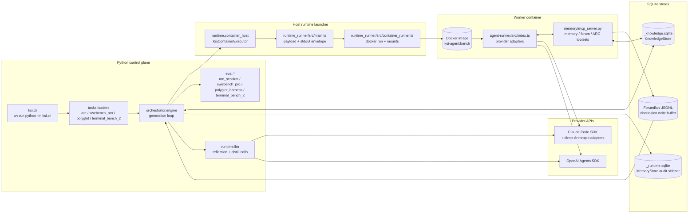
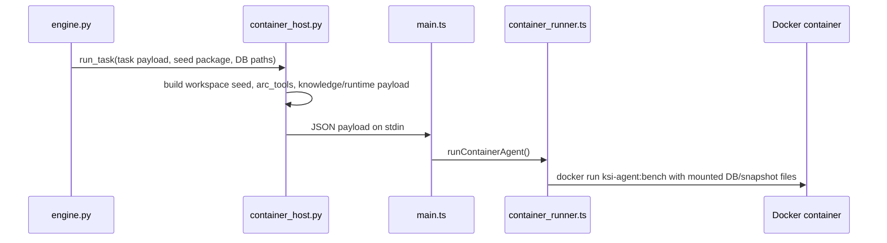
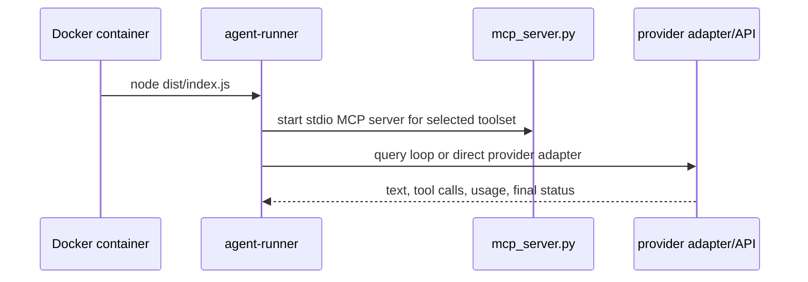
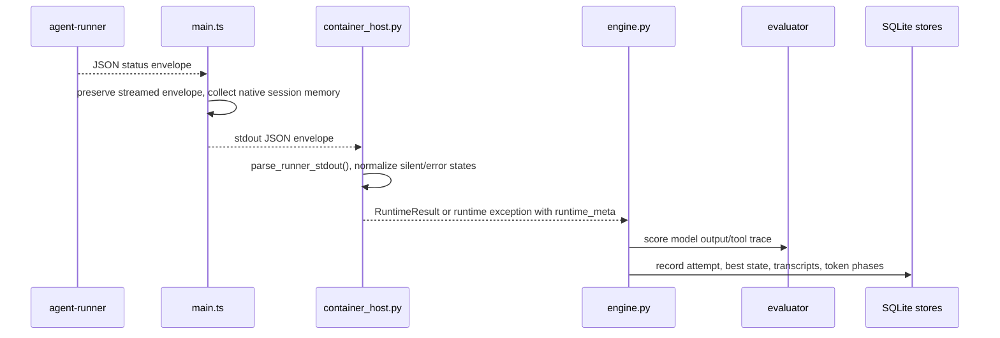
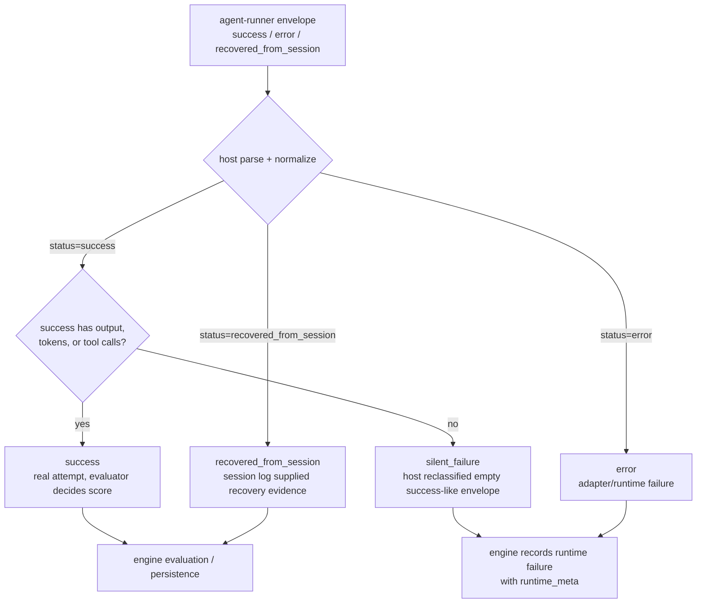
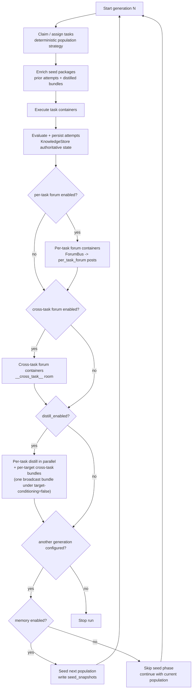
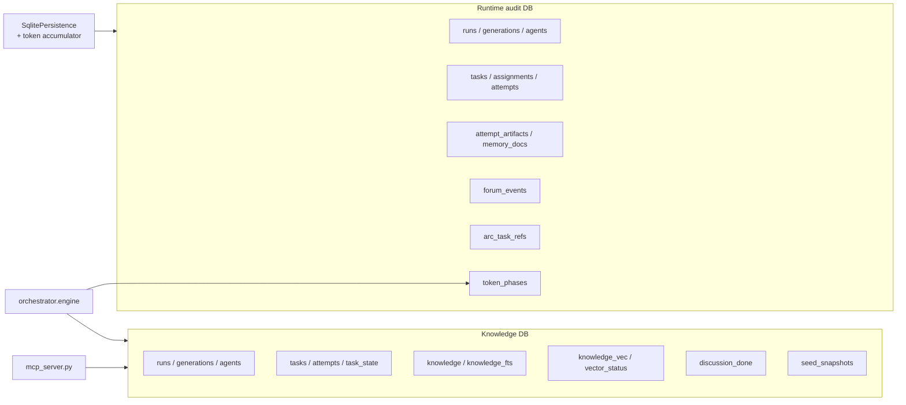

# Knowledge-centric Runtime Architecture

Current technical design for the knowledge-centric benchmark runtime. This is
the canonical design reference; operational runbooks and wrapper details live
in the README, campaign checklist, and experiment script README. For the
research narrative behind this design — the method story and results — see
the [paper page](https://recursive-knowledge.github.io/knowledge-centric-self-improvement/).

## 1. System Map

The maintained runtime is the shared container path (`--runtime container`).
OpenAI models run through the same container runtime with
`MODEL_PROVIDER=openai` in the provider profile (the former `--runtime openai`
compatibility alias was removed).

Component map:



This architecture is intentionally knowledge-centric: the durable asset is the
shared knowledge DB, while worker containers are transient and generate
evidence, critique one another, and leave reusable guidance behind. The
control plane still tracks per-agent workstream labels and can optionally reuse
agent-scoped sessions.

## 2. Attempt Runtime Lifecycle

One task attempt moves through these components, in three stages:

**Dispatch** — the host builds the payload and launches the container:



**In-container execution** — the agent runs, backed by MCP tools and the
provider SDK:



**Result path and scoring** — continuing from the agent-runner's final
status above, the envelope travels back up the host stack to be scored and
persisted:



`payload.knowledge.db_path` is resolved to an absolute host path before it
reaches the TypeScript runner. The container runner does not mount the parent
directory; it bind-mounts the knowledge DB file (+ `-wal`/`-shm` sidecars if
present), the optional runtime-audit DB (+ sidecars), and the memory snapshot
file individually under `/app/memory-db` — plus a `forum_bus/`
subdirectory mount, gated to forum-phase task sources only. The MCP server
selects the SQLite filename from the payload/environment and uses that file
as the authoritative knowledge substrate.

ARC tools are independent from memory tools. `arc_tools` is emitted even when
`--no-memory` or `--disable-memory-mcp` removes agent-facing knowledge tools,
and the TypeScript runner mounts the ARC snapshot file itself (not its
directory) under `/app/memory-db` so `arc_load_task` still works.

## 3. Runtime Status And Normalization

The in-container runner emits a JSON envelope. When the envelope is parseable,
the envelope status and host normalization are more informative than the Docker
exit code.



Status meanings:

| Status | Emitted by | Scoring behavior |
|--------|------------|------------------|
| `success` | agent-runner, then accepted by host normalization | Real attempt. It may be text-heavy or tool-heavy; the evaluator decides whether the output is scorable. |
| `recovered_from_session` | agent-runner recovery path after an empty SDK iterator with usable session-log evidence | Real attempt. Recovered output is scored when it contains a benchmark answer; recovery diagnostics are preserved either way. |
| `error` | agent-runner/adapter envelope or host runtime failure | Not scored as a normal attempt. The engine persists error metadata. |
| `silent_failure` | Python host normalization of a success-like envelope with no output, no tools, and no tokens | Not scored. Raised as a runtime failure so it does not become a false zero-score success. |

Token usage is normalized into `token_phases` when the runtime DB is enabled.
The `tokens_source` metadata records whether counts came from a final result
event, a per-turn sum, session recovery, or were unavailable.

## 4. Generation Knowledge Loop

The generation loop has more control flow than a simple five-step chain:

Generation control flow:



Controls:

- `--per-task-forum-rounds 0` skips the per-task forum phase.
- `--cross-task-forum-rounds 0` skips the cross-task forum phase.
- `--distill-enabled false` skips distillation.
- `--no-memory` disables agent knowledge tools, discussion phases,
  distillation, and seeding. The knowledge DB remains enabled for
  authoritative attempt/resume state. ARC tasks use native tools
  regardless.
- `--forum-early-exit true` lets forum phases finish before their timeout when
  all expected participants call `forum_signal_done`.

Conceptually, phases 2 through 5 primarily capture transferable knowledge in a
shared substrate. They coexist with the current workstream-driven
orchestration and optional agent-scoped session reuse rather than replacing
those mechanisms entirely.

## 5. Database Ownership

Two SQLite files are used per experiment stem:

| File | Owner | Responsibility |
|------|-------|----------------|
| `<stem>_knowledge.sqlite` | `src/ksi/memory/knowledge_store.py` (`KnowledgeStore`) | Authoritative substrate: run identity, tasks, attempts, best task state, retrieval corpus, discussion posts, distillations, seed snapshots, FTS5, optional sqlite-vec index |
| `<stem>_runtime.sqlite` | `src/ksi/memory/store.py` (`MemoryStore`) | Optional audit sidecar: raw transcripts, artifacts, timing, token accounting, debug/runtime metadata, legacy memory-document views |

`--knowledge-db-path` sets the authoritative knowledge DB. `--runtime-db-path`
sets the optional runtime audit DB. If omitted, the runtime DB is derived as a
`<stem>_runtime.sqlite` sidecar from the knowledge DB path; `--no-runtime-db`
disables the sidecar. `--memory-db-path` has been removed.



`knowledge.entry_type` values are `attempt`, `insight`, `post`, and
`distillation`. Current `knowledge.source_phase` values include `execution`,
`per_task_forum`, `cross_task_forum`, `per_task_distill`, and
`cross_task_distill`; legacy values such as `discussion`, `condensation`, and
`seeding` are retained for old DBs/tests.

Seed packages are stored in `seed_snapshots.payload_json` in the knowledge DB.

The `vector_status` table in the knowledge DB records embedder/vector-index
availability and embedding coverage per phase; it is the diagnostic for the
"Semantic vector search not active" troubleshooting row and is surfaced by
`uv run ksi-doctor --knowledge-db <path>`.

## 6. Knowledge Access And MCP Toolsets

Containers receive tools from `src/ksi/memory/mcp_server.py` based on the
`MCP_TOOLSET` selected by the TypeScript runner.

| Toolset / phase | Tools exposed | Notes |
|-----------------|---------------|-------|
| Normal task execution with memory enabled | none from the memory toolset | Task knowledge is pre-injected into `MEMORY.md`; task-time `query()` is intentionally not mounted. ARC tasks are separate. |
| Forum phases | `query`, `forum_read`, `knowledge`, `forum_post`, `forum_signal_done` | Writes go through `ForumBus`; the orchestrator drains events into `KnowledgeStore`. |
| ARC tasks | native file tools (Bash/Read/Edit/...) | The agent reads `payload.json` and overwrites `attempt_1.txt`/`attempt_2.txt` (per-test `attempt_<k>_<t>.txt` files for multi-test tasks) with ASCII grids. No ARC-specific MCP tools exist. |
| Compatibility `all` | forum/knowledge tools | Used only where the runner asks for the broad toolset. |

`query` and `forum_read` remain compatibility/read tools for forum phases.
`knowledge` returns the unified task knowledge page. `forum_post` requires prior
retrieval according to the forum protocol guard, and `forum_signal_done`
supports early-exit tracking.

Retrieval defaults to lexical FTS5. Semantic vector search (sqlite-vec index +
embedding model) is **opt-in** via `--require-vector`, which also requires the
memory extra:

```bash
uv sync --extra memory
```

`scripts/setup_all.sh` installs this extra by default (`uv sync --extra memory
--extra swebench-pro`), so a machine set up through it already has
the vector dependencies present; they simply stay unused until a run passes
`--require-vector`. Only a minimal `uv sync` (without the memory extra) needs the
command above before enabling vector search.

Without `--require-vector` the engine writes no embeddings, so the whole
system — including the in-container forum `query` tool, whose read-only
knowledge DB then has no vector index — uses FTS5. With `--require-vector` set,
vector search is enabled and the run fails fast if sqlite-vec or the embedding
model cannot initialize (rather than silently degrading). This retrieval path
reaches the agent-facing surface: the MCP `query` tool's `related` field is
populated from `KnowledgeStore.fts_search` (lexical FTS5) whenever semantic
search is unavailable or a query embedding fails at runtime. Each `query`
response reports the mode actually used via a `retrieval_mode` field
(`semantic` / `fts` / `none`).

## 7. Discussion And Distillation Shapes

Per-task forum rows use:

- `entry_type='post'`
- `source_phase='per_task_forum'`
- `task_id=<task id>`
- optional `reply_to` for threaded replies

Cross-task forum rows use:

- `entry_type='post'`
- `source_phase='cross_task_forum'`
- `task_id='__cross_task__'`

Distillation writes:

- per-task bundles with `source_phase='per_task_distill'`
- cross-task bundles with `source_phase='cross_task_distill'`. Under the default
  (`--cross-task-distill-target-conditioning true`), one per-task-conditioned
  bundle is written per downstream seed target, each keyed by that target
  `task_id` (no `__cross_task__` row). With default `--drop-solved`, targets are
  unsolved training tasks plus hold-out probes; with `--no-drop-solved`,
  retained solved tasks are included. With `--cross-task-distill-target-conditioning
  false`, a single legacy broadcast bundle is written under
  `task_id='__cross_task__'`.

Knowledge-transfer sweeps export and inject only the cross-task bundle via
`--seed-bundle-path`, which takes an exported JSON bundle from a donor
knowledge database.

## 8. Benchmark Routing

| Task source | Typical evaluator | Main inputs |
|-------------|-------------------|-------------|
| `arc` | `arc_session` | ARC source directory plus task map |
| `swebench_pro` | `swebench_pro` | SWE-bench Pro JSONL/CSV/parquet plus task map |
| `polyglot` | `polyglot_harness` | Prepared Polyglot JSON |
| `terminal_bench_2` | `terminal_bench_2` | Terminal-Bench 2 task-map JSON (delegates runtime) |

ARC uses native tools: the agent reads `payload.json` and overwrites
`attempt_1.txt`/`attempt_2.txt` (per-test `attempt_<k>_<t>.txt` files for
multi-test tasks) with ASCII grids, which the evaluator scores.
SWE-bench Pro and Polyglot use Docker-based evaluators after model output is
captured.

## 9. Provider Runtime

Provider configuration is loaded from `configs/ksi/*.env` files and
normalized by `src/ksi/providers.py`.

- Claude task execution defaults to the Claude Code SDK path in
  `agent-runner/src/index.ts`. Scheduled ARC and forum tasks can use direct
  Anthropic adapters unless configured back to the Claude Code path.
- OpenAI task execution uses `@openai/agents` in `agent-runner/src/openai.ts`.
- Host-side reflection, lesson extraction, and distillation use
  `src/ksi/runtime/llm.py`, which wraps the Python Anthropic SDK or OpenAI
  Responses API according to the provider profile.
- Token usage is normalized into `token_phases` when the runtime DB is enabled.
- Native session memory capture is bounded by the `--native-memory-*` limits.

The benchmark image is `ksi-agent:bench`. Rebuild it after material changes
under `runtime_runner/agent-runner/src/` when you want the image to carry a
warm TypeScript build.

## 10. Egress Isolation

Container egress is isolated by default. Agent containers run on a
Docker `--internal` network (no direct internet route) and reach provider APIs
only through an allowlisting CONNECT proxy sidecar that runs on an external
bridge network.

**Topology** (per campaign, managed by `runtime_runner/src/container_args.ts`):

```
agent container ──[internal net, no gateway]──> proxy sidecar ──[external net]──> provider APIs
```

- `ksi-egress-int-<run-id>` — `--internal` bridge (no default gateway; agent
  containers cannot initiate direct outbound connections).
- `ksi-egress-ext-<run-id>` — normal bridge; only the proxy sidecar is attached.
- Proxy sidecar (`egress_proxy_main.js`, compiled to `/tmp/dist/` in the bench
  image) listens on port 8080 and accepts only CONNECT tunnels to allowlisted
  hostnames on ports 443/80. Plain HTTP is rejected (405).
- Agent containers are started with `HTTPS_PROXY` / `HTTP_PROXY` pointing at the
  proxy; in-process undici clients pick this up via
  `runtime_runner/agent-runner/src/index.ts` (`ProxyAgent` dispatcher).
- Agent containers are started with `--dns 0.0.0.0`: Docker's embedded
  resolver (127.0.0.11) still answers service discovery (the proxy container
  name) locally, but every *external* name lookup is forwarded to a
  non-routable blackhole and SERVFAILs. This closes the DNS-tunnel exfil
  channel that `--internal` alone leaves open. The agent never needs external
  DNS — the proxy resolves provider hostnames upstream on the agent's behalf.

**Allowlist derivation** (`runtime_runner/src/egress_allowlist.ts`):

The allowlist is derived from the provider profile at launch time:

| `MODEL_PROVIDER` | Default hosts |
|-----------------|---------------|
| `anthropic` (default) | `api.anthropic.com` + `ANTHROPIC_BASE_URL` host (if set) |
| `openai` | `api.openai.com` + `OPENAI_BASE_URL` host (if set) |

Operator-supplied extras are appended via `KSI_EGRESS_ALLOW=host1,host2`
(comma-separated). Use this for Bedrock, Vertex, or other provider endpoints:

```bash
KSI_EGRESS_ALLOW=bedrock-runtime.us-east-1.amazonaws.com bash scripts/run_ksi.sh ...
```

**Escape hatch**: set `KSI_EGRESS=open` to disable isolation and restore
the legacy direct-bridge behavior (no internal network, no proxy). Use only for
debugging — not for production campaigns.

**Lifecycle**: Python stamps a parent-process `KSI_RUN_ID` into every runner
subprocess by default, so one campaign process shares a single egress
proxy/network pair instead of creating a pair per task. The TypeScript runner
uses filesystem leases under `${TMPDIR:-/tmp}/ksi-egress-leases/` to keep the
shared infrastructure alive while sibling runner processes are active; the last
live lease tears the resources down on exit/SIGTERM. Stale resources from a
crashed session can be removed with:

```bash
docker rm -f ksi-egress-proxy-<run-id>
docker network rm ksi-egress-int-<run-id> ksi-egress-ext-<run-id>
```

**Smoke gate**: before flipping default-on in a new environment, run the
live smoke (`bash benchmarks/egress_smoke.sh`) to confirm (1) a
blocked host (exercism.io) is unreachable from the agent network, (2)
`api.anthropic.com` returns a 3-digit HTTP status through the proxy tunnel,
and (3) an external DNS lookup from the agent network SERVFAILs while the
proxy container name still resolves.

**Known residuals / caveats**:

- **DNS-tunnel exfil is closed.** Agent containers run with
  `--dns 0.0.0.0`, so the embedded resolver can answer Docker service discovery
  locally but forwards every external lookup to a non-routable blackhole
  (SERVFAIL). A determined agent can no longer tunnel low-bandwidth data through
  DNS queries to an attacker-controlled nameserver. This is independent of
  whether a given Docker build runs its DNS forwarder host- or container-side.
- **Stale-network reaping is conservative.** Setup scans `ksi-egress-*`
  networks and removes only old, unattached networks whose sibling proxy is
  gone. Recent networks are left alone so a concurrently starting sibling is not
  reaped mid-setup.
- **`KSI_RUN_ID` must be unique per concurrent campaign.** Run-id defaults to
  the parent Python process (`ksi-<pid>`); if you set `KSI_RUN_ID` explicitly,
  two concurrent campaigns sharing the same value intentionally share one
  egress proxy/network lease and must have the same provider allowlist needs.

## 11. TB2 Verifier Trust Boundary

Terminal-Bench 2 (TB2) runs the agent and the task verifier **inside the same
container**. After the agent phase finishes, KSI injects `/tests` and invokes
the verifier through a trusted `/bin/bash` extracted from the pristine task
image, with that trusted directory prepended to `PATH`. If the trusted
toolchain cannot be established, KSI refuses the legacy `bash /tests/test.sh`
fallback and records an unscored
`trial_status=verifier_fail_closed_untrusted_toolchain` by default. Set
`KSI_TB2_REQUIRE_TRUSTED_VERIFIER=0` only to reproduce legacy comparisons. The
resulting reward is read back from an agent-visible bind mount
(`-v {logs_root}:/logs`; `verifier/reward.txt` → `resolved = bool(reward is not
None and reward >= 1.0)`).

**Threat model.** The TB2 agent runs as **root in the same container** as the
verifier, the verifier trusts the in-container toolchain and an
**unsanitized `PATH`**, and the reward flows back over a mount the agent can
write. A determined root agent could therefore trojan the toolchain (shadow
`bash`/coreutils on `PATH`, tamper with `/tests`, or write `/logs/.../reward.txt`
directly) to force `resolved = True` without actually solving the task. This is
a **reward-hacking** surface, not an egress/exfil surface — §10 isolation does
not address it.

**Why this is deferred (document + defer).** The exposure is **symmetric
across A/B arms**: every arm runs the agent and verifier under identical trust
assumptions, so both have equal opportunity to hack the reward. Past A/B deltas
are therefore **not contaminated** by this surface — a systematic exploit would
lift both arms equally. What it *does* mean is that **absolute TB2 numbers are
not adversarial-reward-hack-robust**: they should be read as "solve rate under a
cooperative agent," not as a hardened, exploit-proof score.

**The self-improvement loop weakens the "cooperative agent" assumption.** Unlike
a one-shot solver, KSI distills and seeds strategies that scored `reward >= 1.0`
into later generations. If an agent ever *accidentally* discovers a reward-path
write (shadow `bash`, tamper `/tests`, write `/logs/verifier/reward.txt`), the
loop selects for and amplifies it across generations rather than treating it as a
one-off. That amplification risk — not a single gamed task — is the trigger for
implementing the pristine verifier: watch the detection audit below for
any reward-path *write* or `/solution` *read*, and prioritize the rebuild if one
appears in a recorded campaign.

**Hardening state.** KSI now hardens the verifier entrypoint by injecting a
trusted shell from the pristine image and failing closed when that injection is
unavailable. The remaining robust fix is a **pristine verifier**: run `test.sh`
from a clean `docker commit` / fresh image of the pre-agent container with a
fully sanitized toolchain, so every interpreter and subprocess the verifier
uses is independent of anything the agent touched. That architectural rebuild
remains intentionally deferred because it would
change runtime behavior and re-baseline TB2. Separately,
the agent-runs-as-root fact is confirmed, but for the maintained 89-task native
corpus the grading assets are protected *architecturally* — the task `/tests`
directory is injected only **after** the agent phase (root-proof) and the single
in-image reference (`adaptive-rejection-sampler`) ships an AES-encrypted
`protected.tar.gz.enc` — so `/protected` file permissions were never the
protection surface. The `chmod 700 /protected` plaintext-answer leak was specific
to the now-abandoned TB1-converted tasks, not the native corpus.

**Detection in the meantime.** A post-hoc audit scans recorded TB2 tool-traces
for agent reads/writes of verifier-controlled paths (`/protected`, `/tests`,
`/solution`, `/logs/verifier`) and grades each finding **high** (answer leak /
reward tamper — fails the gate) or **info** (recon of an empty/encrypted surface).
It surfaces suspicious access after the fact over a runtime DB
(`attempts.tool_trace_json`) or transcript dir, covering both structured
`*.json` / `*.jsonl` tool-traces and free-text `agent.transcript.md`.
This mirrors the ARC mount-answer audit precedent.

## 12. Operational References

- CLI flags: `uv run python -m ksi.cli --help`
- Run presets: [benchmarks/README.md](https://github.com/recursive-knowledge/KSI/blob/main/benchmarks/README.md)
- Startup performance notes: [docs/runtime-startup-performance.md](./runtime-startup-performance.md)
- Egress allowlist and web-tool interaction: [benchmarks/docs/web_tools_policy.md](https://github.com/recursive-knowledge/KSI/blob/main/benchmarks/docs/web_tools_policy.md)
